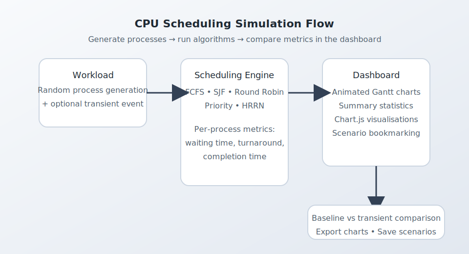

# CPU Scheduling Simulator

A teaching-focused Flask application that visualises how classic CPU scheduling
algorithms behave under varying workloads.  The simulator generates synthetic
process traces, runs multiple algorithms side-by-side, and renders the outcome
with interactive Gantt charts and statistics so that learners can build an
intuitive understanding of operating system schedulers.

<p align="center">
  
  <br/><em>High-level comparison of the transient-event simulation dashboard.</em>
</p>

> ℹ️ The screenshot is included for illustration. You can reproduce it locally
> by following the quick start instructions below.

---

## ✨ Key Features

- **Multiple algorithms** – First-Come, First-Served, Shortest Job First,
  Round Robin, static Priority, and Highest Response Ratio Next.
- **Scenario comparison** – Run a baseline workload and contrast it against a
  user-selected transient event such as a sudden burst of high-priority work.
- **Rich metrics** – Average/min/max/standard deviation for waiting and
  turnaround times, throughput, CPU utilisation, and per-process breakdowns.
- **Interactive visuals** – Bootstrap powered UI with animated Gantt charts and
  Chart.js dashboards for quick side-by-side comparisons.
- **Scenario bookmarking** – Save interesting simulations in the browser's
  localStorage and revisit them later.

---

## 🚀 Quick Start

You can experiment with the simulator using either a local Python environment or
Docker.  Both approaches expose the web UI at <http://localhost:5000>.

### Option 1 – Local environment

```bash
# 1. Clone and enter the repository
 git clone https://github.com/IndrarajBiswas/cpu_scheduling_sim.git
 cd cpu_scheduling_sim

# 2. Create a virtual environment (optional but recommended)
 python -m venv .venv
 source .venv/bin/activate

# 3. Install dependencies
 pip install -r requirements.txt

# 4. Launch the Flask development server
 python app.py
```

### Option 2 – Docker

```bash
# Build the container image
 docker build -t cpu_scheduling_sim .

# Run it (binds port 5000 by default)
 docker run --rm -p 5000:5000 cpu_scheduling_sim
```

A pre-built image is also available on Docker Hub as
[`indygod/cpu_scheduling_sim`](https://hub.docker.com/r/indygod/cpu_scheduling_sim).

---

## 🧭 Using the Simulator

1. **Configure the workload** – Choose how many processes to generate and set
   the arrival and burst time ranges.
2. **Select algorithms** – Tick the scheduling strategies you want to compare.
3. **Pick a transient event** – Inject new processes midway through execution or
   keep the baseline unchanged.
4. **Run simulation** – Submit the form to generate baseline and transient
   results. Each algorithm gets its own card with metrics, an animated Gantt
   chart, and expandable tables.
5. **Analyse the dashboard** – Compare averages in the summary table and explore
   process-level charts. Save scenarios for later from the results page.

Additional screenshots and UI tips live in [`docs/user-guide.md`](docs/user-guide.md).

---

## 🧠 Scheduling Algorithms

| Algorithm | Strategy | Notes |
|-----------|----------|-------|
| FCFS | Non-preemptive, FIFO | Simple baseline, good for demonstrating the convoy effect. |
| SJF | Non-preemptive, shortest burst first | Minimises average waiting time but can starve long processes. |
| Round Robin | Preemptive with fixed quantum | Fair time-slicing suitable for time-sharing systems. |
| Priority | Non-preemptive, static priority | Illustrates the impact of strict priorities on latency. |
| HRRN | Non-preemptive, highest response ratio next | Balances short and long jobs by considering waiting time. |

Implementation details and references for each algorithm are documented in
[`docs/algorithms.md`](docs/algorithms.md).

---

## 🏗️ Project Structure

```
├── app.py             # Flask entry point and scheduling logic
├── templates/         # Jinja templates for the UI
├── requirements.txt   # Python dependencies
├── Dockerfile         # Container image definition
└── docs/              # Extended documentation and assets
```

Developers interested in extending the simulator can consult the annotated
overview in [`docs/architecture.md`](docs/architecture.md).

---

## 🛠️ Development Notes

- The project targets Python 3.9+ and Flask 3.
- Unit tests are not bundled yet; contributions adding automated checks are very
  welcome.
- When tweaking scheduling behaviour, prefer updating the pure Python helper
  functions in `app.py`. The Flask routes are intentionally thin wrappers.
- Static assets (Bootstrap, Chart.js) are loaded from CDNs to keep the repo
  lightweight.

To run Gunicorn locally (mirroring the production Docker image):

```bash
gunicorn --bind 0.0.0.0:5000 app:app
```

---

## 🤝 Contributing

Pull requests are encouraged! Please read [`CONTRIBUTING.md`](CONTRIBUTING.md)
for code style guidelines, suggestions for good first issues, and the review
process.  By participating you agree to abide by our
[`CODE_OF_CONDUCT.md`](CODE_OF_CONDUCT.md).

If you use the simulator for teaching or demos, we would love to hear about your
experience—open a discussion or share feedback via issues.

---

## 📄 Licence

No explicit licence has been declared yet. If you intend to use the code beyond
personal study, please open an issue so that the maintainer can clarify the
licensing terms.

---

## 🙌 Acknowledgements

This simulator was originally developed by **Indraraj Biswas** as part of an
academic project. Improvements in this repository aim to make it easier for
students and instructors to explore CPU scheduling behaviour together.

